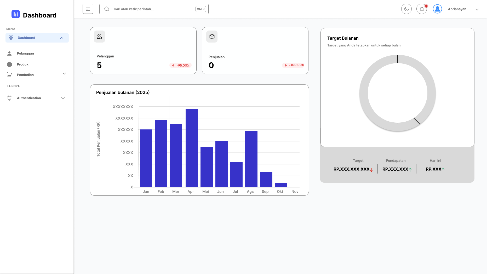

# Pengelolaan-basis-data
Branch TEAM UI/UX
<h2>ANGGOTA UI/UX</h2>
<ol>
  <li>Farischa Arni Iskandar</li>
  <li>Salsabila</li>
</ol>
<a href="https://www.figma.com/design/MYfdgbii0pY6t6DjlRDFql/Untitled?node-id=0-1&t=RXBDfD1fAcDCNpAg-1">LINK UI/UX</a>

<h2>Langkah-langkah Update Tugas UI/UX</h2>
<ol>
  <li>Simpan UI/UX dengan nama preview dan format PNG/JPEG/GIF/SVG/WebP</li>
  <li>Lalu Klik link ini <a href="https://github.com/ZAWARUNO/Pengelolaan-basis-data/upload/UI/UX">Uploud</a></li>
  <li>Masukan File nya dan isi Form perubahan bila perlu</li>
  <li>Selesai terima kasih kerja sama nya</li>
</ol>
